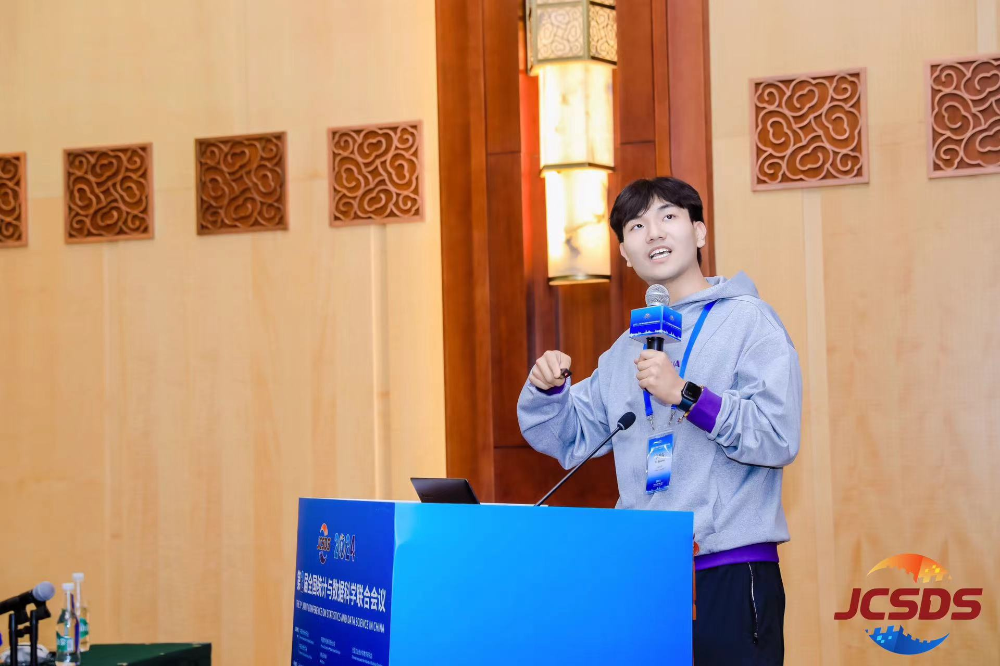

I am currently a second-year PhD candidate in Economics (Statistics) at [Guanghua School of Management](https://www.gsm.pku.edu.cn), Peking University. I am fortunately advised by [Prof. Hansheng Wang](https://sites.google.com/view/hansheng). I obtained my Bachelor's degree in Statistics from School of Statistics, East China Normal University. My research interests lie in **Image Data Analysis** and **Spatial Statistics**. I am particularly interested in the applications of statistics in **Computational Pathology** and **Computational Imaging**.

Education
======

- 2019-2023, B.Sc. in Statistics, School of Statistics, East China Normal University
- 2023- , Ph.D. in Applied Economics (Statistics), Guanghua School of Management, Peking University

Research Interests
======

### Thereticial Statistics

- Spatial statistics
- Nonparametric and semiparametric statistics
- High-dimensional statistics

### Applied Statistics

- Image data analysis
- Computational pathology
